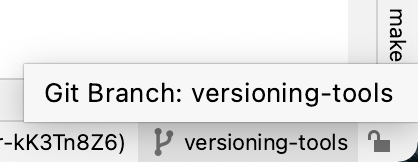
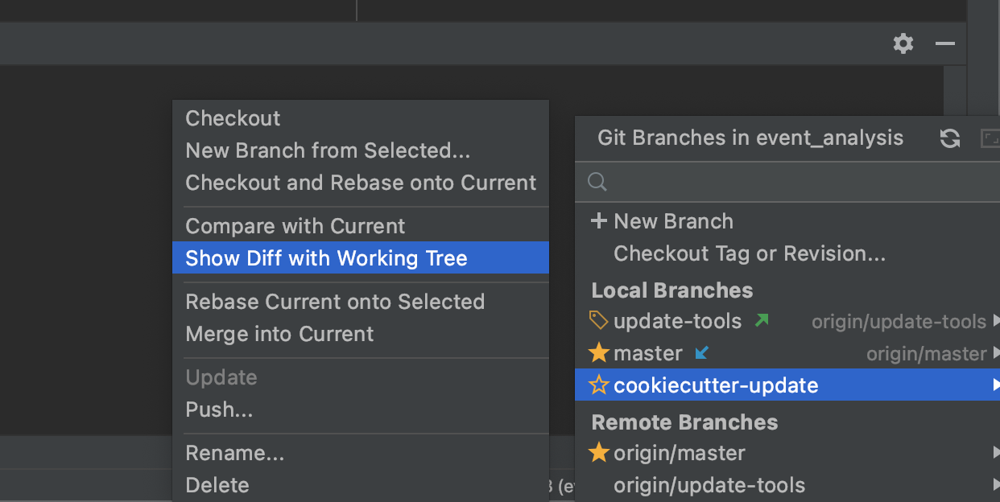
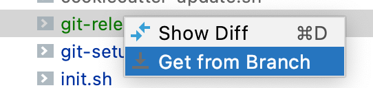

************************************************************************
Updating {{ cookiecutter.project_name }} from cookiecutter
************************************************************************

*To update this repo from* `pipenv-cookiecutter`_, *follow the steps below.*
This is done to pull in any relevant changes/improvements/features introduced in the central `pipenv-cookiecutter`_
repo and provides an easy way to stay up to date with the latest new tools/features that are introduced

Update step-by-step:
********************

Using Pycharm
-------------

    #.  We start by making sure the git working tree is clean for your current branch.
        An easy way to check is to run ``git status``, which should return the phrase "working tree clean".

    #.  Run the `cookiecutter-update.sh`_ script: ``pipenv run cookiecutter_update``
        This will:

        #.  Check out a new branch, **cookiecutter-update**, based on your current branch

        #.  Generate a new cookiecutter based on the responses stored in `cookiecutter.yaml`_

        #.  Commit changes to the **cookiecutter-update** branch

        #.  Checkout your current branch (the one from which you ran the command)

    #.  Using PyCharm, make sure you have your current branch checked out and click the **git branch** in the bottom right corner
        |git branch|

    #.  Select the **cookiecutter-update** branch and click on "Show Diff with Working Tree"
        |show diff|
        to compare changes between your current branch and the newly generated cookiecutter project

    #.  Review each file by double-clicking on the name, selecting the changes you want:

        - click on the ``<<`` arrows in the margin to pull in that change from cookiecutter
        - click on the ``>>`` arrows in the margin to pull in (or keep) that change from your current branch
        - **Do not blindly pull in changes without reviewing them - you might override good work by doing that**

    #.  All new files will be highlighted in green - make sure you pull them into your current branch by:

        - right-clicking on the filename
        - selecting "Get from branch" from the resulting context menu
        - |get from branch|

    #.  When you're done reviewing all the changes and pulling in the ones you need, execute ``pipenv update`` to make
        sure that any changes to the Pipfile (packages and dev-packages) from the Cookiecutter update will be synced and
        locked.

    #.  Finally, ``git add`` the files you want to commit and proceed as normal.

Using command line Git
----------------------

Please note that this method is not recommended since it would take a lot longer
and would potentially be more prone to error.  Use this only when you don't have access to PyCharm's git tools.

    #.  Use ``git diff ${CURRENT_BRANCH}..cookiecutter-update`` to see the changes, replacing ``$(CURRENT_BRANCH)`` with your branch name

    #.  Copy the changes you want to make from cookiecutter to your local file.

    #.  Ensure that all files added by cookiecutter is also added to your local branch

    #.  Add the files: ``git add .`` and commit as usual.

.. _pipenv-cookiecutter: https://github.com/stefmdavis/pipenv-cookiecutter
.. _cookiecutter-update.sh: scripts/init.sh
.. _cookiecutter.yaml: cookiecutter.yaml

